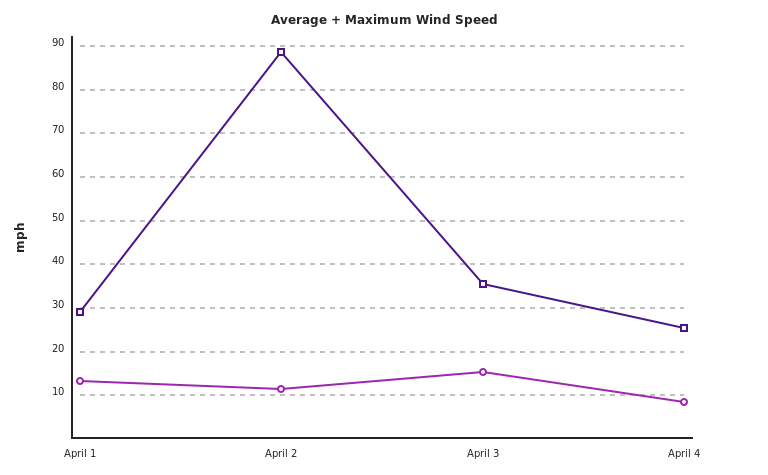

Graph.js
--------
Render line graphs using the HTML5 `<canvas>` element

```javascript
// create new line graph
var line = Graph( 768, 475 );

// plot first series of data
line.plot( [ 12.9, 11.1, 14.9, 8.3 ] );

// set color and symbol
line.set.color( "#9C27B0" );
line.set.symbol( "circle" );

// plot second series of data
line.plot( [ 28.4, 86.4, 34.6, 24.7 ] );

// set color and symbol
line.set.color( "#4A148C" );
line.set.symbol( "square" );

// specify interval of scale values
line.set.interval( 10 );

// set left title
line.set.titleLeft( "mph" );

// set top title
line.set.titleTop( "Average + Maximum Wind Speed" );

// set bottom label
line.set.label( [ "April 1", "April 2", "April 3", "April 4" ] );

// render image and append to DOM
var png = line.render();
document.body.appendChild( png );
```

